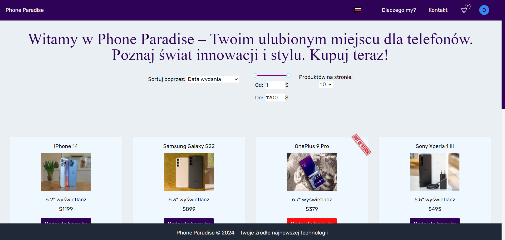
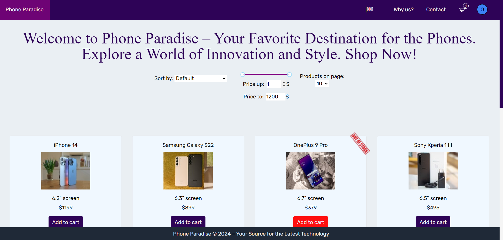
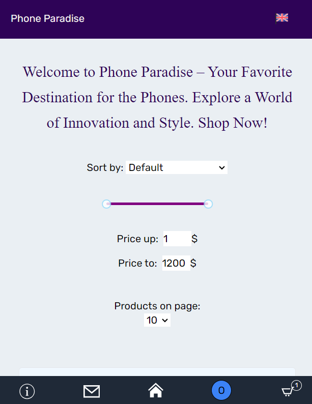
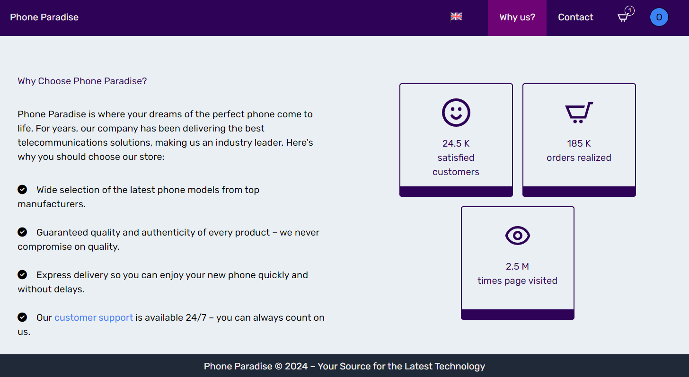

# Dobry Klan Clash Of Clans

## Live site

<a href="https://phoneparadise.netlify.app/">Phone Paradise Live Site</a>

## Technology Stack

 
 

## About Project

Online store has been meticulously crafted using the latest technologies, including React Redux, React Router, Node.js, Express.js and Firebase, to provide you with a seamless and enjoyable shopping experience. Whether you're searching for the latest flagship device, budget-friendly options, or exclusive deals, we have it all under one virtual roof.

## Some result photos

#1 Main page

   
#2 Main page mobile
 

   
#3 Empty cart
 

   
#4 Cart with products

   
#5 Rate after shopping

## Available scripts

In the project directory, you can run:

npm run start
  
The start script is designed to efficiently start your Node.js server located within the "functions" folder. It first navigates to the "functions" directory using the cd command, and then initiates the execution of the server.js file using the node command.

This script is particularly useful when you need to run a server that resides in a subdirectory. It allows you to seamlessly change to the appropriate directory and launch the server with a single npm command.
  
npm run dev
  
The dev script is used to launch your development environment using Vite, a build tool that focuses on providing a fast and efficient development experience for web applications. This script starts a local development server, opens your default web browser, and hosts your application on the specified host.

When you run the dev script, Vite will initiate the development server and provide features such as hot module replacement (HMR) and fast build times, making the development process smoother and more productive.
  
npm run build
  
The build script is a multi-step process used to prepare your TypeScript-based web application for production deployment. It first compiles TypeScript files using the TypeScript compiler (tsc), ensuring your code is converted into JavaScript that can run in a browser. Then, it triggers the Vite build process to optimize and package your application's assets for production.

By using this script, you streamline the process of converting your TypeScript source code into optimized and minified JavaScript files ready for deployment.
  
npm run lint
  
When you run npm run lint, it executes ESLint with these specified options, and ESLint scans your JavaScript and TypeScript files, checking for code quality, style, and potential issues. If it finds any problems or violations of your linting rules, it will report them to the console, allowing you to address and fix them to maintain code quality and consistency in your project.
  
npm run netlify dev
  
The netlify dev script is used to start a local development server provided by Netlify, a platform for deploying and managing web applications. This script is particularly useful for testing and previewing your web application in a local environment that simulates the features and functions of the production environment on the Netlify platform.

Running the netlify dev script launches a development server that not only serves your web application but also offers features such as serverless function execution, form submissions, and other Netlify-specific functionalities.

# Thanks for watching my project, I hope you enjoy with that! :grinning:
